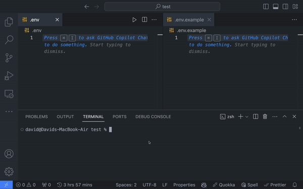

Automatically update your `env` example files using the `mirror` CLI.




## Installation

You can install the `mirror` CLI as a development dependency by running the command below:

```jsx
npm install -D env-mirror
```

## Usage

Once active, the CLI tool will watch the specified `.env` file for changes and update the `.env.example` with the variable names.

You can activate the CLI by running the command below:

```jsx
mirror init
```

The command above watches looks for an `.env` and a `.env.example` file in your project’s root directory. If it doesn't find either of the files, it prints an error to your console and exits.

Alternatively, you can specify the file path of your `.env` and `.env.example` files using the `initialize` option.

The `initialize` option allows you to set your custom file paths for your `.env` and `.env.example` as shown in the table below.

| Flag | Description | Standard Form |
| --- | --- | --- |
| -e | Path to the .env file. | --env |
| -x | Path to the .env.example file. | --example |

Here’s an example using the `initialize` option to watch custom file paths:

```jsx
mirror initialize -e ./.env -x ./.env.example
```

The command above will watch the `env` file at `./.env` and update the example file at `./.env.example`.

### Create an .env.example file for an existing .env file

You can create a `.env.example` file for an existing `.env` file by running the command below:

```jsx
mirror clone
```

The command above checks if your project has an existing `.env.example` file at `<current-dir>/.env.example`. If you have an existing file, it copies the variable names in your `.env` file into your `.env.example` file and starts watching your `.env` file for new changes. If you do not have an existing `.env.example` file, it will create one, copy the `.env` variables, and watch the `.env` file for new changes.